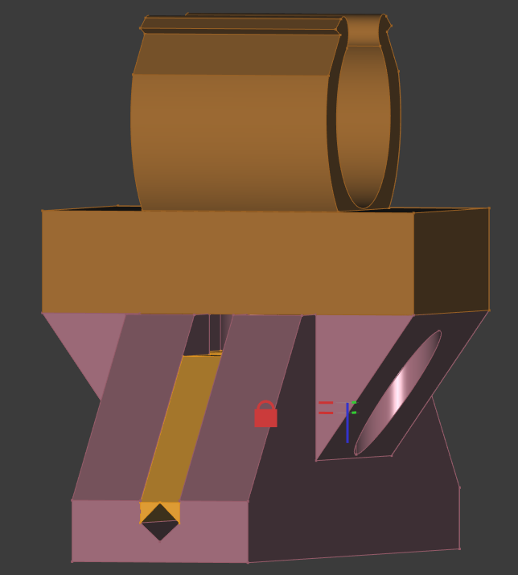
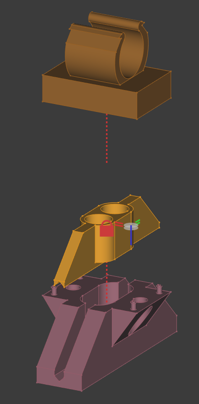
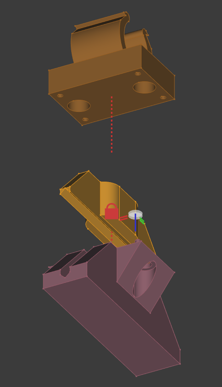

# alweco-clamp
3d printable design for Alweco greenhouse clamp

## Usage
- Print all parts
- Place 2 M5 coarse threaded inserts into [the Hook piece](./Alweco_GreenHouse_Shade_Hook.FCStd)
- place 2 spings into [the Spring Insert piece](./Alweco_GreenHouse_Shade_SpringInsert.FCStd)
- Use 2 10mm M5 coarse socket bolts to attach components together compressing springs over the desired cable